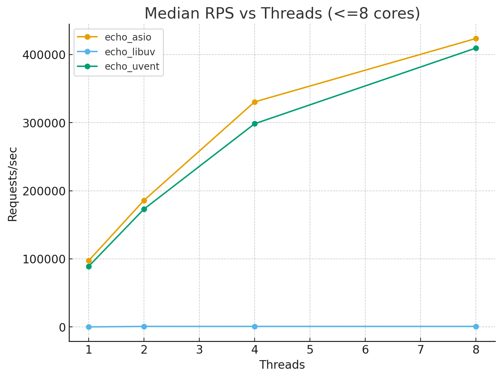

# io_perfomance
Performance profiling of IO libraries using [wrk](https://github.com/wg/wrk).

## Results


# Build
1.
```bash
cmake -B build -DCMAKE_BUILD_TYPE=Release -DWITH_UVENT=ON -DWITH_ASIO=ON -DWITH_LIBUV=ON -DENABLE_LTO=ON
```
2.
```bash
cmake --build build -j
```
# Usage
```bash
chmod +x scripts/*.sh
```
## All libraries:
```bash
THREADS_LIST="1 2 4 8 16" CONN=2000 DUR=60s REUSE=0 scripts/run_all.sh
```
## Certain library
```bash
THREADS=8 CONN=1500 DUR=45s scripts/run_one.sh ./build/echo_uvent
```

# Plots
```bash
python3 scripts/analyze.py --in results/summary.csv --out plots --max-threads 8
```